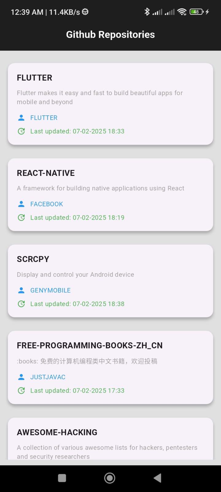

# Popular GitRepos - Flutter App  

## App Information Section: 
   - **App Name:** Popular GitRepos  
   - **Minimum Android SDK:** 26  
   - **Target SDK Version:** 35  
   - **GitHub API Base URL:** https://api.github.com/  
   - **API Documentation:** [GitHub API Documentation](https://docs.github.com/en/rest/search#searchrepositories) 

## Description  
This is a Flutter application that fetches and displays GitHub repositories using "Android" as a query keyword. It provides a seamless user experience, supports offline mode with local database storage, and offers detailed repository information.  

## Features  
1. **Data Fetching:** Fetches repository data from the [GitHub REST API](https://api.github.com/) using "Android" as the query keyword.  
2. **Local Storage:** Stores fetched data in a local database using `sqflite` to allow offline usage.  
3. **Home Page:** Displays a list of repositories.  
4. **Details Page:** Navigate to a detailed view for each repository, showing:  
   - **Owner's Name and Profile Picture**  
   - **Repository Description**  
   - **Watchers**  
   - **Last Update Date/Time in MM-DD-YYYY HH:SS format**  

 ## Dependencies
   - **flutter_secure_storage:** Securely store sensitive data
   - **sqflite:** Local database for offline storage
   - **dio:** Efficient API integration  
   - **GetX:** State management and routing 

## Screenshots 

